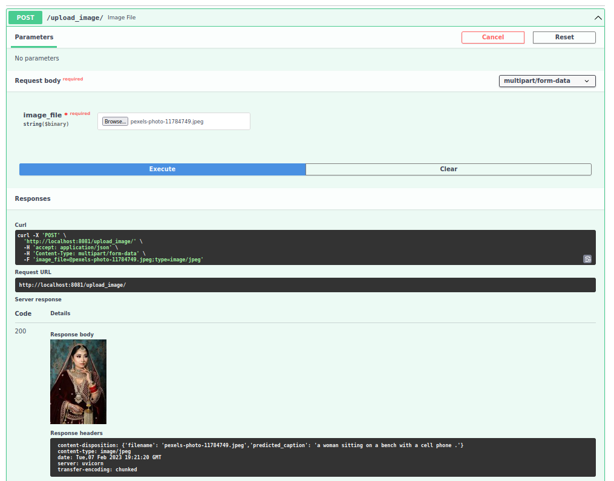

### General image captioning python application
[](https://github.com/bkocis/image-captioning-applications/actions/workflows/python-app.yml)
----
#### Description

This repo contains a general image captioning application using PyTorch and the COCO dataset. 
The application is dockerized and can be deployed on a cloud service. 
The application is also wrapped in a web-server API interface using FastAPI.

### Image captioning PyTorch implementation 
#### using the COCO dataset

### Instructions

Install the `pycoctools` with pip. In case of errors consider installing the "dev" version of python.
`sudo apt install python3.X-dev`

`pip install pycocotools`

Alternatively clone this repo: https://github.com/cocodataset/cocoapi  
```
git clone https://github.com/cocodataset/cocoapi.git  
```

and setup the coco API (also described in the readme [here](https://github.com/cocodataset/cocoapi)) 
```
cd cocoapi/PythonAPI  
make  
cd ..
```

#### Dataset for training - COCO (Common Objects in Context)
Download data from: http://cocodataset.org/#download

* Under **Annotations**, download:
  * **2017 Train/Val annotations [241MB]** (extract captions_train2017.json and captions_val2017.json, and place at locations cocoapi/annotations/captions_train2017.json and cocoapi/annotations/captions_val2017.json, respectively)  
  * **2017 Testing Image info [1MB]** (extract image_info_test2017.json and place at location cocoapi/annotations/image_info_test2017.json)

* Under **Images**, download:
  * **2017 Train images [83K/13GB]** (extract the train2017 folder and place at location cocoapi/images/train2017/)
  * **2017 Val images [41K/6GB]** (extract the val2017 folder and place at location cocoapi/images/val2017/)
  * **2017 Test images [41K/6GB]** (extract the test2017 folder and place at location cocoapi/images/test2017/)

#### Training

#### Deployment
The deployment of the application is on q cloud service providing a bare-bone instance (such as DigitalOcean Droplet or in German provider Strato)

- dockerize the application by running the build (see run_docker.sh)
- save the image as a tar file for transfer to the server
`sudo docker save -o PATH_TO_FILE.tar IMAGE_NAME`

- deliver the tar image to the server 
`rsync -avz PATH_TO_FILE.tar username@remote_server:directory`

- load the image on the server
`sudo docker load -i PATH_TO_FILE.tar`

- killing uvicorns (if running)
(`sudo kill $(pgrep -P PID)`)


### Web-server API interface using FastAPI

To run the image in the background use the following command:

- `docker run -dit -p 8081:8081 IMAGE_NAME` on the remote server



#### Setting up a reverse proxy with nginx

The location section of the nginx config file should look like this:

```
    location /image-captioning {
        proxy_pass http://localhost:8081;
    }
```

The endpoint name should be defined in the fastapi app itself as well (as [here](https://github.com/bkocis/image-captioning-applications/blob/main/application/main.py#L31))
